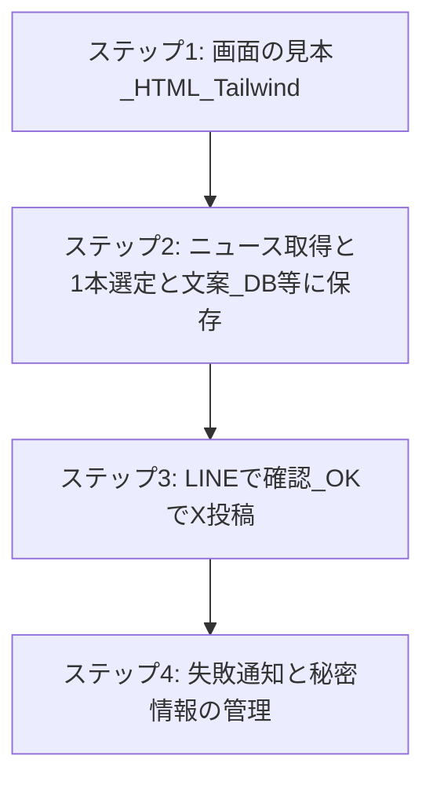
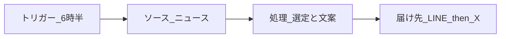

# 推奨する作り方（図解）

朝の建設ニュース → 1本選ぶ → X用の文を作る → LINEで「OK？」→ OKならXに投稿、という仕組みを**分かりやすい順番**で作るときの目安です。

---

## まずこれだけ（4ステップ）

プレビューしなくても読めるように、**文字だけの図**にしています。

```
  STEP 1          STEP 2              STEP 3              STEP 4
 ┌─────────┐    ┌─────────────┐    ┌──────────────┐    ┌─────────────┐
 │ 画面の   │ → │ 記事の取得   │ → │ LINE と X を  │ → │ 失敗したら   │
 │ 見本を   │   │ と「1本選ぶ」 │   │ つなぐ        │   │ 気づける仕組み│
 │ 先に作る │   │ ロジック     │   │               │   │              │
 └─────────┘    └─────────────┘    └──────────────┘    └─────────────┘
   HTML            プログラム         API連携            通知・再実行
  (Tailwind)      (RSSなど)         (公式の仕組み)      (運用)
```

| ステップ | やること | こうしておくと楽 |
|---------|----------|------------------|
| **1** | 完成イメージの **静的HTML**（Tailwind）を作る | 「LINEに何を見せるか」「何を承認するか」が決まる |
| **2** | **ニュース取得**（RSS等）→ **1本に絞る** → **X用の文** → **いったん保存** | まだLINE/Xに繋がなくてよい |
| **3** | **LINE**で候補を送る → 返信で **OK** → **X API**で投稿 | 人が最終チェックしてから公開 |
| **4** | **エラー通知**・**APIキーの管理**・必要なら**再実行** | 朝の1回だけに頼らない |

**覚え方**: 「**見た目 → 中身 → 外との配線 → 運用**」の順。

---

## 講義の「4パーツ」と、この仕組みの対応

```
  トリガー        ソース元         処理する場所           届ける先
 （いつ動く）   （データの元）   （中で何をするか）    （どこに出すか）

     │               │                 │                    │
     ▼               ▼                 ▼                    ▼
 毎朝6:30      建設系の記事      ・最新から1本選ぶ     ・まず LINE
 タイマーで     （RSSなど        ・X用の文を作る       　（人が確認）
 起動する        安全な取得）    ・承認待ちで保存      ・OKなら Xへ投稿
```

---

## 1日の流れ（だれがいつ動くか）

```
  6:30頃          あなたのサーバ              あなた           X
    │                    │                     │            │
    │ ① 起動してね        │                     │            │
    ├──────────────────►│                     │            │
    │                    │ ② ニュース取得       │            │
    │                    │ ③ 1本＋文案を決める  │            │
    │                    │                     │            │
    │                    │ ④ LINEに送る         │            │
    │                    ├────────────────────►│            │
    │                    │                     │            │
    │                    │     ⑤ 「OK」返信     │            │
    │                    │◄────────────────────┤            │
    │                    │                     │            │
    │                    │ ⑥ OKなら投稿API      │            │
    │                    ├─────────────────────────────────►│
    │                    │                     │            │
```

⑥ で **NG** のときは、投稿せず別処理（再提案・翌日まで保留など）にできます。

---

## なぜ「HTMLを先」なのか

```
   いきなりプログラムだけ作る        先にHTMLで見本を作る
   ─────────────────────          ─────────────────────
   あとから「画面が違う」            最初に「こう見せたい」が固定できる
   手戻りが増えやすい                そのあとデータを流し込むだけに近づく
```

---

## 図（Mermaid・プレビュー用）

エディタの Markdown プレビューや GitHub で表示できる**同じ内容の図**です。

### 作る順番（縦に読む）



### 4パーツのつながり



---

## 注意（短く）

- 記事は **RSS・公式の配信など、ルールがはっきりした取り方**を優先するのが安全です。
- X への投稿は **API の条件・料金**を事前に確認してください。

別リポジトリで実装するときは、このファイルをコピーして使って構いません。
